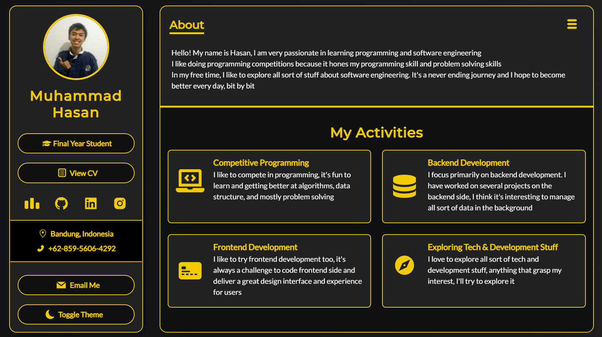

# My Personal Portfolio Website



## Description

This is my personal website where I my put my information including activities, resume, and projects.
Created with NextJs, Typescript, React, Framer Motion, and Tailwind CSS

## Getting Started

### Dependencies

- [NodeJs](https://nodejs.org/en/)
- [NPM](https://www.npmjs.com/) (Node Package Manager)
- [NextJs](https://nextjs.org/)

### Executing program

* Download this directory using the download button
* After downloading the directory, make sure to have `node` and `npm` installed and just use:
```bash
> npm run build
> npm run start
```

## Authors

Muhammad Hasan ([muhammadhasan01](https://github.com/muhammadhasan01))

## License

This project is licensed under the GNU GENERAL PUBLIC LICENSE

## Acknowledgments

- All the tutorials that have been used
- Tailwind CSS documentations
- Lighthouse so I can improve my site
- Hat Tip for [Dev-Sumit](https://github.com/Dey-Sumit) for the huge reference!
